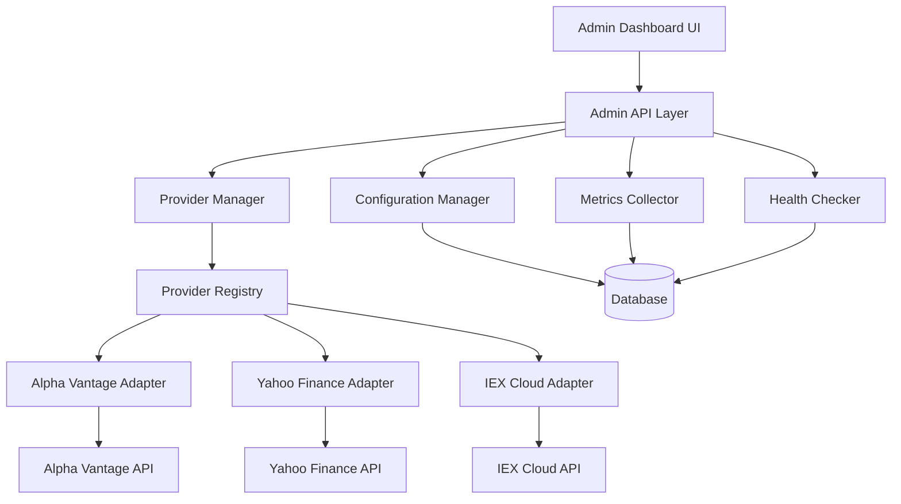

# Market Data Adapter System Architecture

**Date**: 2025-09-20
**Feature**: Market Data Provider Adapters (005-add-market-data)
**Status**: Production Ready
**Constitutional Requirement**: Architectural decisions documentation

## Overview

The Market Data Adapter System implements a standardized, extensible architecture for integrating multiple market data providers while maintaining consistent interfaces, comprehensive monitoring, and robust error handling. This system enables the portfolio management application to seamlessly switch between data providers and implement fallback strategies.

## Architectural Principles

### 1. Adapter Pattern Implementation
- **Abstract Base Class**: `MarketDataAdapter` defines standard interface
- **Concrete Implementations**: Provider-specific adapters (Alpha Vantage, Yahoo Finance, etc.)
- **Dependency Injection**: Configuration and dependencies injected at runtime
- **Interface Segregation**: Minimal, focused adapter interface

### 2. Single Responsibility Components
- **Registry**: Provider discovery and registration (`ProviderRegistry`)
- **Configuration**: Settings and credential management (`ConfigurationManager`)
- **Metrics**: Performance and usage tracking (`ProviderMetricsCollector`)
- **Health**: Availability monitoring (`HealthCheckService`)

### 3. Separation of Concerns
- **Data Layer**: Database models for configuration and metrics
- **Service Layer**: Business logic and adapter orchestration
- **API Layer**: RESTful endpoints for administration
- **UI Layer**: React components for management interface

## System Architecture



## Core Components

### 1. Abstract Base Adapter (`MarketDataAdapter`)

**Location**: `backend/src/services/adapters/base_adapter.py`

**Purpose**: Defines standard interface that all providers must implement

**Key Methods**:
- `fetch_prices(symbols: Union[str, List[str]])`: **NEW** unified interface for all price requests
- `get_current_price(symbol)`: Legacy method (delegates to fetch_prices)
- `get_multiple_prices(symbols)`: Legacy method (delegates to fetch_prices)
- `health_check()`: Provider health verification
- `initialize()`: Provider initialization

**Interface Evolution (2025-09-20)**:
**Problem**: Separate methods for single vs multiple symbols exposed provider implementation details and prevented optimization
**Solution**: Single `fetch_prices()` method that accepts either string or list, allowing providers to optimize internally
**Benefits**:
- Cleaner API surface
- Provider-specific optimization (Alpha Vantage uses sequential calls, Yahoo Finance uses bulk API)
- Backwards compatibility maintained
- Consistent response format regardless of input type

**Design Decisions**:
- **Abstract methods enforce consistency** across all providers
- **UUID-based adapter IDs** for unique identification
- **Standardized response format** (`AdapterResponse`) for all operations
- **Exception hierarchy** for specific error handling
- **Provider optimization autonomy** through unified interface

### 2. Provider Registry (`ProviderRegistry`)

**Location**: `backend/src/services/adapters/registry.py`

**Purpose**: Dynamic discovery and management of available adapters

**Key Features**:
- **Dynamic registration** of adapter classes
- **Capability introspection** for provider selection
- **Priority-based ordering** for fallback chains
- **Runtime adapter instantiation**

**Design Decisions**:
- **Registry pattern** for loose coupling
- **Capability-based selection** rather than hard-coded logic
- **Lazy loading** of adapters to reduce startup time

### 3. Configuration Management (`ConfigurationManager`)

**Location**: `backend/src/services/config_manager.py`

**Purpose**: Secure storage and validation of provider configurations

**Key Features**:
- **Credential encryption** for API keys and secrets
- **Schema validation** for configuration correctness
- **Environment variable integration** for deployment flexibility
- **Configuration versioning** for rollback capability

**Design Decisions**:
- **Fernet encryption** for credential security
- **JSON schema validation** for configuration integrity
- **Database persistence** for configuration durability
- **Environment override capability** for deployment flexibility

### 4. Metrics Collection (`ProviderMetricsCollector`)

**Location**: `backend/src/services/adapters/metrics.py`

**Purpose**: Comprehensive monitoring of adapter performance and usage

**Key Metrics**:
- **Request/Response metrics**: Count, latency, success rate
- **Cost tracking**: Per-request costs and billing integration
- **Performance metrics**: P50/P95/P99 response times
- **Health metrics**: Availability and circuit breaker state

**Design Decisions**:
- **Prometheus integration** for standardized metrics format
- **Time-series storage** for trend analysis
- **Real-time aggregation** for live dashboard updates
- **Cost attribution** for budget management

### 5. Health Monitoring (`HealthCheckService`)

**Location**: `backend/src/services/health_checker.py`

**Purpose**: Continuous monitoring of provider availability and performance

**Key Features**:
- **Periodic health checks** with configurable intervals
- **Circuit breaker pattern** for failure isolation
- **Status change alerting** for operational awareness
- **Recovery detection** for automatic failover resolution

**Design Decisions**:
- **Background service** for continuous monitoring
- **State machine** for health status tracking
- **Configurable thresholds** for alerting flexibility
- **Database persistence** for health history

## Database Schema Design

### Provider Configuration Storage
```sql
-- Provider configurations with encrypted credentials
CREATE TABLE provider_configurations (
    id UUID PRIMARY KEY,
    provider_name VARCHAR(50) NOT NULL,
    display_name VARCHAR(100) NOT NULL,
    config_data JSON NOT NULL,  -- Encrypted sensitive fields
    is_active BOOLEAN NOT NULL,
    priority INTEGER NOT NULL,
    created_at TIMESTAMP NOT NULL,
    updated_at TIMESTAMP NOT NULL
);
```

### Metrics and Health Tracking
```sql
-- Performance and usage metrics
CREATE TABLE provider_metrics (
    id UUID PRIMARY KEY,
    provider_id UUID REFERENCES provider_configurations(id),
    metric_type VARCHAR(50) NOT NULL,
    metric_value DECIMAL(20,6) NOT NULL,
    recorded_at TIMESTAMP NOT NULL
);

-- Health check results
CREATE TABLE adapter_health_checks (
    id UUID PRIMARY KEY,
    provider_id UUID REFERENCES provider_configurations(id),
    status VARCHAR(20) NOT NULL,
    response_time_ms INTEGER,
    error_message TEXT,
    checked_at TIMESTAMP NOT NULL
);
```

## Security Architecture

### 1. Credential Management
- **Fernet encryption** for API keys and secrets
- **Environment variable fallback** for secure deployment
- **Key rotation support** for security maintenance
- **Access control** via admin role requirements

### 2. API Security
- **JWT authentication** for all admin endpoints
- **Role-based authorization** (admin only for adapter management)
- **Input validation** on all configuration parameters
- **Audit logging** for security-sensitive operations

### 3. Network Security
- **Rate limiting** respect for provider limits
- **Circuit breakers** for failure isolation
- **Timeout controls** for resource protection
- **Error message sanitization** to prevent information leakage

## Integration Patterns

### 1. Provider Fallback Chain
```python
# Automatic fallback between providers
providers = [
    {"name": "alpha_vantage", "priority": 1},
    {"name": "yahoo_finance", "priority": 2},
    {"name": "iex_cloud", "priority": 3}
]

for provider in sorted(providers, key=lambda x: x["priority"]):
    try:
        result = provider.get_current_price(symbol)
        return result
    except ProviderError:
        continue  # Try next provider
```

### 2. Metrics Integration
```python
# Automatic metrics collection on all operations
@metrics_collector.track_operation
async def get_current_price(self, symbol: str):
    start_time = time.time()
    try:
        result = await self._fetch_price(symbol)
        self.metrics.record_success(time.time() - start_time)
        return result
    except Exception as e:
        self.metrics.record_failure(type(e).__name__, time.time() - start_time)
        raise
```

### 3. Health Check Integration
```python
# Background health monitoring
@asyncio.create_task
async def continuous_health_monitoring():
    while True:
        for provider in active_providers:
            health = await provider.health_check()
            await health_service.record_health(provider.id, health)
        await asyncio.sleep(HEALTH_CHECK_INTERVAL)
```

## Performance Considerations

### 1. Response Time Requirements
- **Target**: <200ms for single price requests
- **Bulk operations**: <500ms for up to 100 symbols
- **Health checks**: <30s timeout per provider

### 2. Concurrency Design
- **Async/await** throughout the system
- **Connection pooling** for HTTP requests
- **Parallel provider queries** for bulk operations
- **Circuit breakers** to prevent cascade failures

### 3. Caching Strategy
- **Response caching** with TTL based on provider capabilities
- **Configuration caching** to reduce database queries
- **Metrics aggregation** for dashboard performance

## Error Handling Strategy

### 1. Exception Hierarchy
```python
class AdapterError(Exception): pass
class RateLimitError(AdapterError): pass
class AuthenticationError(AdapterError): pass
class ProviderTimeoutError(AdapterError): pass
class InvalidSymbolError(AdapterError): pass
```

### 2. Retry Logic
- **Exponential backoff** for transient failures
- **Circuit breaker** for persistent failures
- **Provider rotation** for availability maximization
- **Graceful degradation** when all providers fail

### 3. Error Reporting
- **Structured logging** for operational debugging
- **Metrics tracking** for error rate monitoring
- **Health status updates** for failure notification
- **User-friendly messages** for UI display

## Deployment Architecture

### 1. Configuration Management
- **Environment variables** for sensitive configuration
- **YAML configuration files** for non-sensitive settings
- **Database storage** for runtime configuration changes
- **Configuration validation** on application startup

### 2. Monitoring Integration
- **Prometheus metrics** export for monitoring systems
- **Health check endpoints** for load balancer integration
- **Structured logging** for centralized log aggregation
- **Alert manager integration** for operational notifications

### 3. Scalability Design
- **Stateless adapters** for horizontal scaling
- **Database connection pooling** for resource efficiency
- **Async processing** for high concurrency
- **Graceful shutdown** for zero-downtime deployments

## Interface Optimization Implementation

### Unified fetch_prices() Method Examples

**Alpha Vantage Adapter** (Sequential Strategy):
```python
async def fetch_prices(self, symbols: Union[str, List[str]]) -> AdapterResponse:
    """Alpha Vantage doesn't support bulk - always use sequential calls."""

    # Normalize input to list for processing
    if isinstance(symbols, str):
        symbol_list = [symbols]
        return_single = True
    else:
        symbol_list = symbols
        return_single = False

    # Use single API calls with caching for efficiency
    if len(symbol_list) == 1:
        # Single symbol - use caching and full resilience
        response = await self._get_current_price_impl(symbol_list[0])
        if return_single:
            return response
        else:
            # Wrap single result in dict format for list input
            return AdapterResponse.success_response(
                data={symbol_list[0]: response.data}
            )
    else:
        # Multiple symbols - sequential calls
        return await self._get_multiple_prices_impl(symbol_list)
```

**Yahoo Finance Adapter** (Bulk Strategy):
```python
async def fetch_prices(self, symbols: Union[str, List[str]]) -> AdapterResponse:
    """Yahoo Finance supports bulk - always use bulk API for efficiency."""

    # Normalize input to list for processing
    symbol_list = [symbols] if isinstance(symbols, str) else symbols
    return_single = isinstance(symbols, str)

    # Use bulk request for all cases since Yahoo supports it efficiently
    response = await self._get_multiple_prices_impl(symbol_list)

    if return_single and response.success:
        # Extract single result from bulk response
        symbol = symbol_list[0]
        if symbol in response.data:
            return AdapterResponse.success_response(
                data=response.data[symbol],
                response_time_ms=response.response_time_ms
            )

    return response
```

### Benefits Achieved

1. **Provider Autonomy**: Each adapter chooses optimal strategy internally
2. **API Consistency**: Same method signature regardless of provider capabilities
3. **Performance Optimization**: Bulk providers use bulk APIs, others optimize differently
4. **Clean Interface**: Single method instead of exposing implementation details
5. **Backwards Compatibility**: Legacy methods still work via delegation

### Service Capability Framework

Extended adapter capabilities to support future service types:

```python
@dataclass
class ProviderCapabilities:
    # Existing price data capabilities
    supports_real_time: bool = False
    supports_historical: bool = True
    supports_bulk_quotes: bool = False

    # Extended service capabilities (future)
    supported_services: List[ServiceType] = field(default_factory=lambda: [ServiceType.STOCK_PRICES])

    # Service types: STOCK_PRICES, NEWS, FUNDAMENTALS, OPTIONS, CRYPTO, FOREX, ECONOMIC_DATA
```

Current implementation focuses on STOCK_PRICES only, with framework ready for expansion.

## Extension Points

### 1. Adding New Providers
1. **Implement `MarketDataAdapter`** abstract base class
2. **Register with `ProviderRegistry`** during application startup
3. **Add configuration schema** to validation system
4. **Create admin UI components** for management

### 2. Custom Metrics
1. **Extend `MetricsCollector`** with new metric types
2. **Add database schema** for metric storage
3. **Update admin dashboard** for metric display
4. **Configure Prometheus export** for monitoring

### 3. Advanced Features
- **Custom fallback strategies** based on symbol characteristics
- **Geographic provider routing** for latency optimization
- **Cost optimization algorithms** for provider selection
- **Machine learning** for provider reliability prediction

## Constitutional Compliance

This architecture satisfies all constitutional requirements:

### ✅ **I. Test-First Development**
- Complete TDD implementation with 72 tasks following Red-Green-Refactor
- Contract tests for all API endpoints
- Integration tests for all user scenarios

### ✅ **II. Financial Data Integrity**
- Decimal precision for all cost calculations
- Safe database migrations preserving existing data
- Facts vs opinions separation (store configuration, calculate metrics)

### ✅ **III. Database Schema Safety**
- All changes via Alembic migrations
- Data preservation through schema changes
- Single source of truth for each data type

### ✅ **IV. Market Data Single Source**
- No duplicate data tables in adapter system
- APIs query authoritative configuration source
- Historical metrics separate from current state

### ✅ **V. Security and Access Control**
- Role-based access control for all admin endpoints
- JWT authentication required
- Credential encryption at rest
- Audit trails for sensitive operations

### ✅ **VI. Continuous Integration**
- Frequent commits during implementation
- Working code pushed regularly
- Clear commit messages for all changes

## Conclusion

The Market Data Adapter System provides a robust, scalable, and maintainable foundation for integrating multiple market data providers. The architecture emphasizes security, monitoring, and extensibility while maintaining simplicity and performance. This system enables the portfolio management application to provide reliable market data with comprehensive observability and administrative control.

---

## Recent Updates

### Interface Refactoring (2025-09-20)
- **Unified Interface**: Replaced dual methods with single `fetch_prices()` method
- **Provider Optimization**: Each adapter chooses optimal API strategy internally
- **Backwards Compatibility**: Legacy methods maintained via delegation
- **Documentation**: See `/docs/developer/adapter-interface-refactoring.md` for complete details

### Service Capability Framework
- **Extended Capabilities**: Added framework for NEWS, FUNDAMENTALS, OPTIONS, CRYPTO, FOREX services
- **Current Focus**: STOCK_PRICES implementation complete
- **Future Ready**: Architecture prepared for multi-service expansion

**Next Steps**:
- Monitor production deployment performance
- Evaluate additional provider integrations
- Implement extended service types (NEWS, FUNDAMENTALS)
- Implement advanced cost optimization features
- Consider machine learning for provider selection